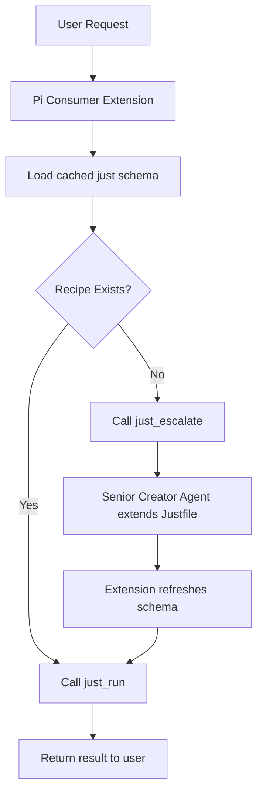

# Annex A: The Consumer Agent (The Executor)

## 🆔 Identity & Role
The **Consumer Agent** is the primary user-facing interface. It should be lightweight, fast, local-first, and optimized for mapping natural language onto the `Justfile` API instead of generating new capabilities itself.

- **Reference Runtime**: [Pi Coding Agent](https://github.com/badlogic/pi-mono/tree/main/packages/coding-agent)
- **Reference Local Model**: a custom Ollama alias built from **Qwen 3.6**
- **Focus**: natural language -> `just` recipe selection -> safe execution -> escalation when the API surface is insufficient

This is the ideal role for a smaller local model: it should be a **tool user**, not a **tool author**.

## ✅ Why Pi Fits This Role
Pi is intentionally minimal and extension-first. That matches the goals of `just-for-agents` well:

1. **Model transport belongs in config**: Pi already supports local OpenAI-compatible providers such as Ollama through `models.json`.
2. **Behavior belongs in extensions**: Pi extensions can register tools, commands, session state, and system-prompt injections without forcing us to fork Pi.
3. **The Justfile remains the API**: the extension can discover `just bootstrap` and `just schema`, then expose only a tiny consumer-safe tool surface to the model.

The recommended implementation is therefore:

1. **Custom Ollama model** for Qwen 3.6
2. **Pi model config** for Ollama
3. **A small project-local Pi extension** that enforces the Consumer contract

This repo now includes a concrete reference bundle under `examples/pi-consumer/`:

- `Modelfile`
- `models.json`
- `settings.json`
- `package.json`
- `profile.json`
- `just-consumer.ts`

To use the bundle as-is:

1. copy `models.json` into `~/.pi/agent/models.json` (or merge it)
2. copy `settings.json` into your project's `.pi/settings.json`
3. copy `just-consumer.ts` into `.pi/extensions/just-consumer.ts`
4. copy `package.json` into `.pi/extensions/package.json` and run `npm install` there so Pi can resolve `typebox`
5. optionally copy `profile.json` into `.pi/consumer-profile.json` for branding and personalization

## 🧱 Reference Implementation

### 1. Create a Custom Ollama Model
Use a custom model name so the Pi-side experience is stable even if the underlying Qwen tag changes.

```dockerfile
# Modelfile
FROM qwen3.6:latest

PARAMETER temperature 0.2
PARAMETER top_p 0.9
PARAMETER num_ctx 32768

SYSTEM """
You are a concise local utility assistant.
Your runtime exposes a narrow, project-defined toolset; treat that toolset as the entire capability surface and do not assume access to a shell, filesystem, or other ad-hoc tools.
Prefer exact tool use over long freeform answers, and do not invent capabilities the toolset does not provide.
"""
```

```bash
ollama create just-consumer-qwen3.6:latest -f Modelfile
```

The model should stay **generic and reusable**. The stricter Consumer behavior should live in the Pi extension, not be baked deeply into the model itself.

### 2. Register the Model with Pi
Pi already documents Ollama support via `~/.pi/agent/models.json`, so use that instead of writing a custom provider extension unless dynamic model discovery becomes necessary later.

```json
{
  "providers": {
    "ollama": {
      "baseUrl": "http://localhost:11434/v1",
      "api": "openai-completions",
      "apiKey": "ollama",
      "compat": {
        "supportsDeveloperRole": false,
        "supportsReasoningEffort": false,
        "supportsUsageInStreaming": false,
        "maxTokensField": "max_tokens"
      },
      "models": [
        {
          "id": "just-consumer-qwen3.6:latest",
          "name": "Qwen 3.6 Consumer",
          "reasoning": false,
          "input": ["text"],
          "contextWindow": 32768,
          "maxTokens": 4096,
          "cost": { "input": 0, "output": 0, "cacheRead": 0, "cacheWrite": 0 }
        }
      ]
    }
  }
}
```

See also: [`examples/pi-consumer/models.json`](../../examples/pi-consumer/models.json)

If the specific Qwen build requires local thinking flags, use Pi's documented OpenAI compatibility overrides and switch to a Qwen-specific `thinkingFormat`. For the base Consumer role, `reasoning: false` is the safest default.

### 3. Add Project-Local Pi Settings
Keep the Consumer Agent project-local so entering this repo gives the intended behavior immediately.

```json
{
  "defaultProvider": "ollama",
  "defaultModel": "just-consumer-qwen3.6:latest",
  "defaultThinkingLevel": "off",
  "quietStartup": true
}
```

See also: [`examples/pi-consumer/settings.json`](../../examples/pi-consumer/settings.json)

Recommended project layout:

```text
.pi/
  settings.json
  extensions/
    just-consumer.ts
```

Pi auto-discovers `.pi/extensions/*.ts`, which keeps the integration aligned with the project's **Zero Configuration** preference.

See also: [`examples/pi-consumer/just-consumer.ts`](../../examples/pi-consumer/just-consumer.ts)

## 🔌 The Pi Consumer Extension

The extension should do the `just-for-agents` protocol work once, then give the model a narrow tool surface.

### Extension Responsibilities

On `session_start`, the extension should:

1. Detect whether the workspace contains a `Justfile`
2. Run `just bootstrap`
3. Run `just schema`
4. Parse and cache the manifest
5. Load optional personalization from `.pi/consumer-profile.json` or `~/.pi/agent/consumer-profile.json`
6. Switch Pi into **Consumer mode**
7. Visually brand the Pi instance and show startup guidance through `ctx.ui.notify()` and `ctx.ui.setWidget()`
8. Expose only consumer-safe tools to the model

On `before_agent_start`, the extension should inject:

- the Consumer role instructions
- a compact summary of available recipes from the cached schema
- a clear statement that the four Consumer tools are the entire toolset (rather than scolding the model for shell/edit/write usage that is already impossible)
- optional personality-affinity instructions derived from the profile

The primary mechanism for the toolset restriction is `pi.setActiveTools(CONSUMER_TOOLS)` on `session_start`, which removes `bash`, `edit`, `write`, and any other non-Consumer tools from the model's available tool list. As defense-in-depth, the extension also installs a `tool_call` hook that blocks `bash`, `edit`, and `write` if Consumer mode is active — but the model should never see those tool names in the first place.

On `turn_start` or `session_start`, the extension should persist its cached state with `pi.appendEntry()` so resumed sessions restore the manifest and mode cleanly.

The startup introduction and guidance should be **UI-only** when possible, so they help the human user without polluting the model context. In Pi, that means preferring `ctx.ui.notify()` and `ctx.ui.setWidget()` over injected messages.

## 🧰 Consumer Tool Contract

The model should see a tiny toolset:

| Tool | Purpose |
| --- | --- |
| `just_schema` | Return the cached manifest, optionally refreshing it |
| `just_run` | Execute a validated `just` recipe with mapped arguments |
| `just_escalate` | Invoke `just escalate "<prompt>"`, then auto-refresh the cached schema on success |
| `just_refresh` | Re-run `bootstrap` and `schema` after direct `Justfile` changes |

### `just_run` Rules
`just_run` is the core tool. It should:

1. Validate that the requested recipe exists in the cached schema
2. Validate that only known parameters are passed
3. Build argv in schema parameter order, passing recipe parameters positionally
4. Execute without shell interpolation
5. Return structured stdout/stderr/exit information

This is important: because the Consumer Agent has no shell tool available, it cannot improvise shell commands even if it wanted to — it must call the documented API surface emitted by `just schema`. The tool call can still use named fields like `{ "file": "/path/to/file" }`, but the extension must translate those into positional `just` argv such as `just md5 /path/to/file`.

For the `research` recipe specifically, `rounds` should be treated as the number of **new** rounds to append in the current invocation. If the user asks for "1 iteration" or "one more round", the Consumer should call `research` with `rounds='1'` and let the recipe continue from the latest completed round automatically.

When keyed tool arguments skip an optional recipe parameter that has a schema default, the Consumer extension should fill that default automatically before executing the positional `just` command. This avoids false validation failures such as requiring `source=''` to be passed explicitly before `subject_id`.

## 🧪 Pi-Native Skeleton

The in-repo reference implementation is at `examples/pi-consumer/just-consumer.ts`. The following excerpt shows the intended shape:

```typescript
import { spawnSync } from "node:child_process";
import { existsSync } from "node:fs";
import type { ExtensionAPI } from "@mariozechner/pi-coding-agent";
import { Type } from "typebox";

export default function (pi: ExtensionAPI) {
  let manifest: any | undefined;
  let consumerMode = false;

  function refreshManifest(cwd: string) {
    const bootstrap = spawnSync("just", ["bootstrap"], { cwd, encoding: "utf8" });
    if (bootstrap.status !== 0) throw new Error(bootstrap.stderr || "just bootstrap failed");

    const schema = spawnSync("just", ["schema"], { cwd, encoding: "utf8" });
    if (schema.status !== 0) throw new Error(schema.stderr || "just schema failed");

    manifest = JSON.parse(schema.stdout);
  }

  function activateConsumerMode(ctx: any) {
    consumerMode = true;
    pi.setActiveTools(["just_schema", "just_run", "just_escalate", "just_refresh"]);
    ctx.ui.setStatus("consumer", ctx.ui.theme.fg("accent", "consumer"));
  }

  pi.registerTool({
    name: "just_schema",
    label: "Just Schema",
    description: "Return the cached just-for-agents manifest",
    parameters: Type.Object({}),
    async execute(_toolCallId, _params, _signal, _onUpdate, ctx) {
      if (!manifest) refreshManifest(ctx.cwd);
      return {
        content: [{ type: "text", text: JSON.stringify(manifest, null, 2) }],
        details: {}
      };
    }
  });

  pi.registerTool({
    name: "just_run",
    label: "Just Run",
    description: "Execute a recipe from the current just schema",
    parameters: Type.Object({
      recipe: Type.String(),
      args: Type.Optional(Type.Record(Type.String(), Type.String()))
    }),
    async execute(_toolCallId, params, _signal, _onUpdate, ctx) {
      if (!manifest) refreshManifest(ctx.cwd);
      const result = spawnSync(
        "just",
        [params.recipe, ...Object.entries(params.args || {}).map(([k, v]) => `${k}=${v}`)],
        { cwd: ctx.cwd, encoding: "utf8" }
      );

      return {
        content: [
          {
            type: "text",
            text: [result.stdout, result.stderr].filter(Boolean).join("\n").trim() || "(no output)"
          }
        ],
        details: { exitCode: result.status ?? 1 }
      };
    }
  });

  pi.registerTool({
    name: "just_escalate",
    label: "Just Escalate",
    description: "Ask the Senior Creator Agent for a new capability",
    parameters: Type.Object({
      prompt: Type.String()
    }),
    async execute(_toolCallId, params, _signal, _onUpdate, ctx) {
      const result = spawnSync("just", ["escalate", params.prompt], { cwd: ctx.cwd, encoding: "utf8" });
      if (result.status !== 0) {
        throw new Error([result.stdout, result.stderr].filter(Boolean).join("\n").trim());
      }
      const currentManifest = refreshManifest(ctx.cwd);
      return {
        content: [{
          type: "text",
          text: [
            [result.stdout, result.stderr].filter(Boolean).join("\n").trim(),
            `Consumer schema refreshed (${(currentManifest.tools ?? []).length} tools).`
          ].filter(Boolean).join("\n\n")
        }],
        details: { exitCode: result.status ?? 1, toolCount: (currentManifest.tools ?? []).length }
      };
    }
  });

  pi.registerTool({
    name: "just_refresh",
    label: "Just Refresh",
    description: "Re-run just bootstrap and just schema",
    parameters: Type.Object({}),
    async execute(_toolCallId, _params, _signal, _onUpdate, ctx) {
      refreshManifest(ctx.cwd);
      return {
        content: [{ type: "text", text: "Refreshed bootstrap instructions and schema." }],
        details: {}
      };
    }
  });

  pi.on("session_start", async (_event, ctx) => {
    if (!existsSync(`${ctx.cwd}/Justfile`)) return;
    refreshManifest(ctx.cwd);
    activateConsumerMode(ctx);
    pi.appendEntry("consumer-state", { manifest, consumerMode: true });
  });

  pi.on("before_agent_start", async (event) => {
    if (!consumerMode || !manifest) return;
    return {
      systemPrompt:
        event.systemPrompt +
        "\n\nYou are the Consumer Agent. Your only tools are just_schema, just_run, just_refresh, and just_escalate — " +
        "no shell, file-edit, or write tools are available. The Justfile is the entire capability surface; " +
        "call just_schema instead of parsing the Justfile source directly."
    };
  });

  // Defense-in-depth: setActiveTools above already removes bash/edit/write
  // from the model's tool list. This hook is a belt-and-braces guard in case
  // the active-tools restriction is ever bypassed.
  pi.on("tool_call", async (event) => {
    if (consumerMode && ["bash", "edit", "write"].includes(event.toolName)) {
      return { block: true, reason: "Consumer mode only allows just-for-agents tools." };
    }
  });
}
```

## 🔁 The Interface Contract

### 1. Discovery
The Consumer Agent MUST obtain:

1. `just bootstrap` instructions
2. `just schema` manifest

In Pi, the extension should do this automatically on `session_start` and on explicit refresh.

### 2. Execution Logic
When the user provides a request:

1. **Match** the intent against the cached `just schema`
2. **Execute** the best-fitting recipe through `just_run`
3. **Report** stdout/stderr clearly
4. **Retry once** only if the failure is obviously due to argument mapping

### 3. Escalation Logic
The Consumer Agent SHOULD call `just_escalate` when:

- no matching recipe exists in the manifest
- the recipe surface is too weak for the user request
- the user explicitly asks for a new capability

## 📊 Flow Diagram



## 🛠 Implementation Notes

### Prefer `models.json` over `registerProvider()`
Pi already supports Ollama directly. Use a Pi extension for behavior, not for transport, unless you later need:

- dynamic model discovery from `/v1/models`
- a non-standard local gateway
- custom streaming behavior

### Keep the Consumer Agent Narrow
This role should stay:

- **local**
- **cheap**
- **tool-first**
- **non-authoring**

The moment it needs to invent new tools, it should leave that work to the **Senior Creator Agent**.
