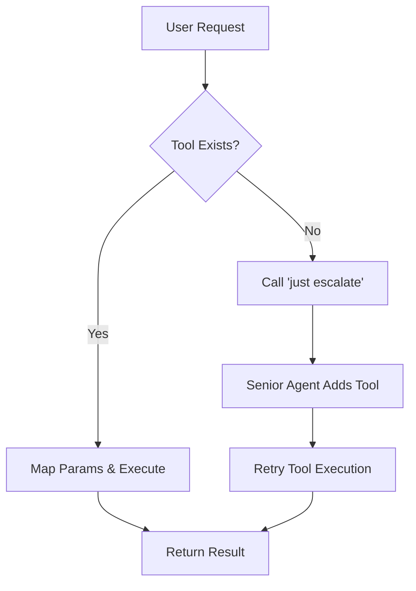

# Annex A: The Consumer Agent (The Executor)

## 🆔 Identity & Role
The **Consumer Agent** is the primary interface for the user. It should be lightweight, fast, and optimized for tool-calling.

- **Recommended Models**: Gemini Flash 2.0, Llama-3-8B (local), Qwen 3.6 (local), Claude Haiku.
- **Focus**: Natural language to `just` command mapping.

## 🔌 The Interface Contract

### 1. Discovery
Upon entering a workspace, the Consumer Agent MUST:
1. Run `just bootstrap` to receive initial instructions.
2. Run `just schema` to get the JSON tool manifest.

### 2. Execution Logic
When a user provides a request:
1. **Match**: Parse the `just schema` output to find a recipe that matches the intent.
2. **Execute**: Map user parameters to recipe arguments and run the `just <recipe> <args>` command.
3. **Handle Failure**: If a tool fails, report the error or try a different parameter set.

### 3. Escalation Logic
The Consumer Agent SHOULD call `just escalate "<prompt>"` when:
- No matching recipe is found in the `just schema`.
- The existing tools are insufficient for the complexity of the request.
- The user explicitly asks for a new capability ("Add a tool to...").

## 📊 Flow Diagrams

### Tool Call vs. Escalation

## 🛠 Implementation Note
The Consumer Agent does not need to understand how the tools are built; it only needs to know how to call them and how to ask for help via `escalate`.
