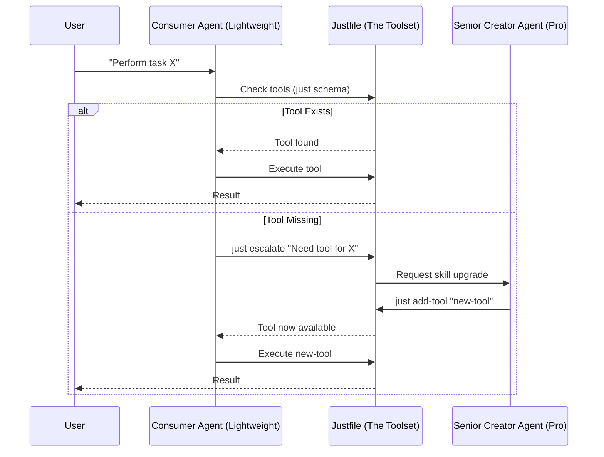

# The Personal Power Agent: User Guide

## 🚀 Vision: RADICALLY SIMPLE
`just-for-agents` turns your standard `Justfile` into a personalized, ever-evolving toolset for AI agents. It's the "Root" of your personal automation, allowing lightweight agents to perform complex tasks while high-reasoning agents build the tools they need.

## 💡 Why use this?
- **Inexpensive & Fast**: Use smaller, faster models (like Gemini Flash or local LLMs) for daily tasks.
- **Self-Improving**: When a task is too complex, the agent automatically asks a "Senior Agent" to build a new tool.
- **Zero Config**: Your `Justfile` *is* the configuration. No complex setup, no external databases.

## 🔄 How it Works
The interaction follows a seamless "Escalation Loop":



## 🛠 Recommended Setup: Pi + Ollama + Qwen 3.6

This repo now includes a concrete Consumer Agent bundle in `examples/pi-consumer/`. The setup below installs that exact stack.

### 1. Install Pi and Ollama

```bash
npm install -g @mariozechner/pi-coding-agent
brew install ollama
```

If Ollama is not already running, start it:

```bash
ollama serve
```

### 2. Build the local Consumer model

From the root of this repo:

```bash
ollama create just-consumer-qwen3.6:latest -f examples/pi-consumer/Modelfile
```

### 2a. Build the local Research model

If you want `just research` to prefer a research-tuned local model, also build:

```bash
ollama create just-research-qwen3.6:latest -f examples/pi-consumer/ResearchModelfile
```

### 3. Register the model with Pi

For a fresh Pi setup:

```bash
mkdir -p ~/.pi/agent
cp examples/pi-consumer/models.json ~/.pi/agent/models.json
```

If you already use Pi and already have `~/.pi/agent/models.json`, merge the Ollama provider entry instead of overwriting the whole file.

### 4. Install the project-local Consumer extension

From the root of this repo:

```bash
mkdir -p .pi/extensions
cp examples/pi-consumer/settings.json .pi/settings.json
cp examples/pi-consumer/just-consumer.ts .pi/extensions/just-consumer.ts
cp examples/pi-consumer/package.json .pi/extensions/package.json
cp examples/pi-consumer/profile.json .pi/consumer-profile.json
npm install --prefix .pi/extensions
```

This gives the project the exact Pi setup described in Annex A:

- default provider: `ollama`
- default model: `just-consumer-qwen3.6:latest`
- default thinking: `off`
- project-local Pi extension: `just-consumer.ts`
- optional personalization hook: `.pi/consumer-profile.json`

### 5. Start Pi in this repo

```bash
pi
```

On startup, the Consumer extension will:

1. detect the local `Justfile`
2. run `just bootstrap`
3. run `just schema`
4. load `.pi/consumer-profile.json` if present
5. cache the manifest
6. switch Pi into Consumer mode
7. show branded startup guidance in the Pi UI without sending it into model context when possible

### 6. Use the Consumer Agent the intended way

Good prompts:

- "Show me what tools are available here."
- "Run the tool that hashes a file."
- "Archive the large files in downloads."

Expected behavior:

1. Pi uses the local Qwen Consumer model
2. the extension restricts the model to `just_schema`, `just_run`, `just_refresh`, and `just_escalate`
3. with shell, file-edit, and write tools removed from its toolset, the model maps your request onto `just` recipes — the Justfile is the entire capability surface it sees
4. if the current API is insufficient, it escalates through `just escalate`

When `just escalate` runs in a shell with `tmux` available, it creates or reuses the fixed tmux session `just-for-agents-escalate`, starts the Senior Agent in a prompt-derived window, and tells you how to attach. In iTerm2, it also attempts to open a tmux control-mode window automatically; later reattach with `tmux attach-session -t just-for-agents-escalate`.

Research runs use the same visible-agent tmux interface. When `just research` launches a round with `tmux` available, it creates or reuses the fixed session `just-for-agents-research`, opens a prompt-derived window, and prints the matching attach command before waiting for the round to finish. Research requests are incremental: `rounds='1'` appends one new round for that subject instead of retrying round 1.

## 🛠 Process Feedback: Making Shell + tmux Less Awful

After live testing, the most effective process changes are:

1. **Split model roles**: keep the Consumer model chat-oriented and use a separate research-tuned model for `just research`.
2. **Prefer helper recipes over inline shell tricks**: temp config generation, result validation, and summary extraction are now private helper recipes instead of fragile inline one-liners.
3. **Use an isolated scratch workspace for research**: the agent now gets a single `RESEARCH_TASK.md` file instead of free roaming through the repo from the first turn.
4. **Validate outputs instead of trusting them**: research rounds now validate the result and retry once instead of silently accepting conversational fallbacks.
5. **Use built-in runtime helpers instead of ad-hoc tmux commands**:
   - `just research-status subject_id='ways-to-improve-the-research-tool'`
   - `just research-reset`

The goal is to make the debugging loop about **research behavior**, not shell quoting, temp-file templates, or manual tmux archaeology.

### 7. Refresh after changing the Justfile

If `just_escalate` adds or removes recipes, the Consumer extension now refreshes its cached schema automatically after the escalation succeeds.

If you edit the `Justfile` directly while Pi is open:

```text
/consumer-refresh
```

Or reload all project resources:

```text
/reload
```

## 📦 Files Used by This Setup

| File | Purpose |
| --- | --- |
| `examples/pi-consumer/Modelfile` | Creates the Consumer Agent Ollama model alias |
| `examples/pi-consumer/ResearchModelfile` | Creates the research-tuned Ollama model alias |
| `examples/pi-consumer/models.json` | Registers the Ollama model with Pi |
| `examples/pi-consumer/settings.json` | Sets the project-local default model/provider |
| `examples/pi-consumer/just-consumer.ts` | Enforces the Consumer Agent contract in Pi |
| `examples/pi-consumer/package.json` | Supplies the extension dependency (`typebox`) |
| `examples/pi-consumer/profile.json` | Optional branding, introduction, guidance, and personality-affinity hooks |

## 📖 Annexes
- [Annex A: The Consumer Agent](annexes/consumer_agent.md) - Pi + Ollama reference implementation for a lightweight utility chatbot.
- [Annex B: The Senior Agent](annexes/senior_agent.md) - For defining the creator contract and safety.
